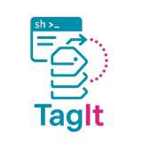
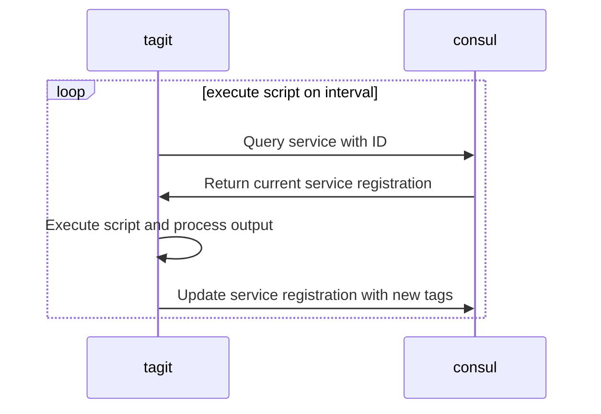

[](https://goreportcard.com/report/github.com/ncode/tagit)
[](https://opensource.org/licenses/Apache-2.0)
[](https://codecov.io/gh/ncode/tagit)

TagIt is a tool that updates Consul service registration tags with script output.
It keeps the existing registration, replaces managed tags that match `tag-prefix` (using the `prefix-value` format), and preserves non-prefixed tags.

## Table of Contents

- [Why TagIt?](#why-tagit)
- [Installation](#installation)
- [Usage](#usage)
  - [Run Command](#run-command)
  - [Cleanup Command](#cleanup-command)
  - [Systemd Command](#systemd-command)
- [How It Works](#how-it-works)
- [Configuration](#configuration)
- [Examples](#examples)
- [Development](#development)
- [Troubleshooting](#troubleshooting)
- [Contributing](#contributing)
- [License](#license)

## Why TagIt?

TagIt addresses a feature that's currently missing from Consul. You can read more about the need for this functionality in [this Consul issue](https://github.com/hashicorp/consul/issues/1048).

Here are some scenarios where TagIt can be useful:

1. **Database Leader Tagging**: Ensure all writes go to the leader by tagging it appropriately.
2. **Non-Consul-Aware Service Discovery**: Use Consul for service discovery with services that aren't Consul-aware.
3. **Web Server VHost Tagging**: Tag all vhosts served by a web server or load balancer.
4. **Generic Service Tagging**: Tag any services for Consul-based service discovery.

## Installation

To install TagIt, use the following commands:

```bash
git clone https://github.com/ncode/tagit
cd tagit
go build -o tagit .
```

## Usage

TagIt provides three main commands: `run`, `cleanup`, and `systemd`.

### Run Command

The `run` command starts TagIt and continuously updates the tags based on the script output:

```bash
./tagit run \
  --consul-addr=127.0.0.1:8500 \
  --service-id=my-service1 \
  --script=/tmp/tagit-query.sh \
  --interval=5s \
  --tag-prefix=tagit
```

### Cleanup Command

The `cleanup` command removes all tags with the specified prefix from the service:

```bash
./tagit cleanup \
  --consul-addr=127.0.0.1:8500 \
  --service-id=my-service1 \
  --tag-prefix=tagit
```

### Systemd Command

The `systemd` command generates a systemd service file for TagIt:

```bash
./tagit systemd \
  --service-id=my-service1 \
  --script=/tmp/tagit-query.sh \
  --tag-prefix=tagit \
  --interval=5s \
  --user=tagit \
  --group=tagit
```

This command will output a systemd service file that you can use to run TagIt as a system service.

## How It Works

TagIt interacts with Consul as follows:



## Configuration

TagIt supports configuration through:

- **CLI flags** (`--consul-addr`, `--service-id`, `--script`, `--tag-prefix`, `--interval`, `--token`)
- **Config file** with `--config` (default: `$HOME/.tagit.yaml`)
- **Environment variables** (Viper automatic binding)

Example `~/.tagit.yaml`:

```yaml
consul-addr: "127.0.0.1:8500"
service-id: "my-service1"
script: "/path/to/tagit-query.sh"
tag-prefix: "tagit"
interval: "5s"
token: "your-consul-token"
```

Note: `run` and `cleanup` use inherited root flags, while `systemd` defines and validates its own flags.

## Examples

Here's an example of how to test TagIt:

1. Start a Consul agent in development mode:
   ```bash
   consul agent -dev &
   ```

2. Create a script that emits dynamic tags (whitespace-separated output):
   ```bash
   cat >/tmp/tagit-query.sh <<'EOF'
   #!/usr/bin/env sh
   echo primary replica
   EOF
   chmod +x /tmp/tagit-query.sh
   ```

3. Register a service with Consul:
   ```bash
   cat >/tmp/my-service1.json <<'EOF'
   {
     "ID": "my-service1",
     "Name": "my-service1",
     "Address": "127.0.0.1",
     "Port": 8080,
     "Tags": ["static"]
   }
   EOF
   curl --request PUT --data @/tmp/my-service1.json http://127.0.0.1:8500/v1/agent/service/register
   ```

4. Run TagIt:
   ```bash
   ./tagit run \
   --consul-addr=127.0.0.1:8500 \
   --service-id=my-service1 \
   --script=/tmp/tagit-query.sh \
   --interval=5s \
   --tag-prefix=tagit
   ```

5. Generate a systemd service file:
   ```bash
   ./tagit systemd \
   --service-id=my-service1 \
   --script=/tmp/tagit-query.sh \
   --tag-prefix=tagit \
   --interval=5s \
   --user=tagit \
   --group=tagit > /etc/systemd/system/tagit-my-service1.service
   ```

6. Clean up the tags:
   ```bash
   ./tagit cleanup \
   --consul-addr=127.0.0.1:8500 \
   --service-id=my-service1 \
   --tag-prefix=tagit
   ```

## Development

Use the Makefile targets for local development and testing:

- Build the binary:
  ```bash
  make build
  ```

- Run unit tests:
  ```bash
  make test
  ```

- Run integration tests using Docker Compose (`docker-compose.test.yml`):
  ```bash
  make consul-up
  make test-integration
  make consul-down
  ```

- Run all tests including integration with local Consul lifecycle:
  ```bash
  make test-all
  ```

## Troubleshooting

### Common issues

- `service-id is required`
  - Provide `--service-id` in CLI args or in `~/.tagit.yaml`.

- `script is required` / `interval is required and cannot be empty or zero`
  - `--script` must be present.
  - `--interval` must be a valid duration (for example `5s`, `30s`, `1m`), not `0` or empty.

- `failed to create Consul client`
  - Verify `--consul-addr` points to a reachable Consul instance (default `127.0.0.1:8500`).
  - Confirm Consul is running before retrying.

- `error getting service: ...`
  - Confirm the service exists in Consul with the exact `service-id`.

- `error running script` or command parse/exec errors
  - `script` is executed through shell tokenization; ensure quoting is correct.
  - Example with spaces: `--script='echo primary replica'`.

- No visible updates in Consul
  - TagIt is idempotent by design; if managed tags are already up-to-date, it skips the write.

- `script execution timed out after 30s`
  - The default command timeout is 30 seconds.
  - Reduce script runtime or shorten work done inside the script.

### `systemd` command tips

- Missing required flag errors (for example: `required flag(s) "group" not set`)
  - `systemd` requires: `--service-id`, `--script`, `--tag-prefix`, `--interval`, `--user`, `--group`.

- `failed to execute template`
  - Re-check generated values and ensure flags are valid before saving output.

### Quick checks

- Verify Consul leader endpoint:
  ```bash
  curl --silent http://127.0.0.1:8500/v1/status/leader
  ```

- Verify service exists in Consul:
  ```bash
  curl --silent http://127.0.0.1:8500/v1/agent/services | jq '."my-service1"'
  ```

- Validate cleanup command behavior:
  ```bash
  ./tagit cleanup \
    --consul-addr=127.0.0.1:8500 \
    --service-id=my-service1 \
    --tag-prefix=tagit
  ```

## Contributing

Contributions to TagIt are welcome! Please feel free to submit a Pull Request.

## License

TagIt is licensed under the Apache License, Version 2.0. See the [LICENSE](LICENSE) file for details.
