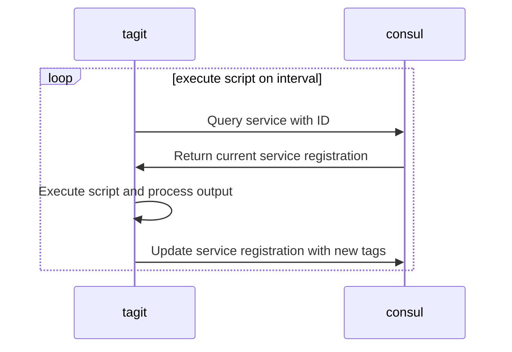

# TagIt


[](https://goreportcard.com/report/github.com/ncode/tagit)
[](https://opensource.org/licenses/Apache-2.0)
[](https://codecov.io/gh/ncode/tagit)

TagIt is a tool that updates Consul service registration tags with outputs of a script. It copies the current service registration and appends the output of the script line by line as tags, while keeping the original tags.

## Table of Contents

- [Why TagIt?](#why-tagit)
- [Installation](#installation)
- [Usage](#usage)
  - [Run Command](#run-command)
  - [Cleanup Command](#cleanup-command)
  - [Systemd Command](#systemd-command)
- [How It Works](#how-it-works)
- [Examples](#examples)
- [Contributing](#contributing)
- [License](#license)

## Why TagIt?

TagIt addresses a feature that's currently missing from Consul. You can read more about the need for this functionality in [this Consul issue](https://github.com/hashicorp/consul/issues/1048).

Here are some scenarios where TagIt can be useful:

1. **Database Leader Tagging**: Ensure all writes go to the leader by tagging it appropriately.
2. **Non-Consul-Aware Service Discovery**: Use Consul for service discovery with services that aren't Consul-aware.
3. **Web Server VHost Tagging**: Tag all vhosts served by a web server or load balancer.
4. **Generic Service Tagging**: Tag any services for Consul-based service discovery.

## Installation

To install TagIt, use the following commands:

```bash
$ git clone https://github.com/ncode/tagit
$ cd tagit
$ go build
```

## Usage

TagIt provides three main commands: `run`, `cleanup`, and `systemd`.

### Run Command

The `run` command starts TagIt and continuously updates the tags based on the script output:

```bash
$ ./tagit run --consul-addr=127.0.0.1:8500 --service-id=my-service1 --script=./examples/tagit/example.sh --interval=5s --tag-prefix=tagit
```

### Cleanup Command

The `cleanup` command removes all tags with the specified prefix from the service:

```bash
$ ./tagit cleanup --consul-addr=127.0.0.1:8500 --service-id=my-service1 --tag-prefix=tagit
```

### Systemd Command

The `systemd` command generates a systemd service file for TagIt:

```bash
./tagit systemd --service-id=my-service1 --script=./examples/tagit/example.sh --tag-prefix=tagit --interval=5s --user=tagit --group=tagit
```

This command will output a systemd service file that you can use to run TagIt as a system service.

## How It Works

TagIt interacts with Consul as follows:



## Examples

Here's an example of how to test TagIt:

1. Start a Consul agent in development mode:
   ```bash
   consul agent -dev &
   ```

2. Register a service with Consul:
   ```bash
   curl --request PUT --data @examples/consul/my-service1.json http://127.0.0.1:8500/v1/agent/service/register
   ```

3. Run TagIt:
   ```bash
   ./tagit run --consul-addr=127.0.0.1:8500 --service-id=my-service1 --script=./examples/tagit/example.sh --interval=5s --tag-prefix=tagit
   ```

4. Generate a systemd service file:
   ```bash
   ./tagit systemd --service-id=my-service1 --script=./examples/tagit/example.sh --tag-prefix=tagit --interval=5s --user=tagit --group=tagit > /etc/systemd/system/tagit-my-service1.service
   ```

5. Clean up the tags:
   ```bash
   ./tagit cleanup --consul-addr=127.0.0.1:8500 --service-id=my-service1 --tag-prefix=tagit
   ```

## Contributing

Contributions to TagIt are welcome! Please feel free to submit a Pull Request.

## License

TagIt is licensed under the Apache License, Version 2.0. See the [LICENSE](LICENSE) file for details.
