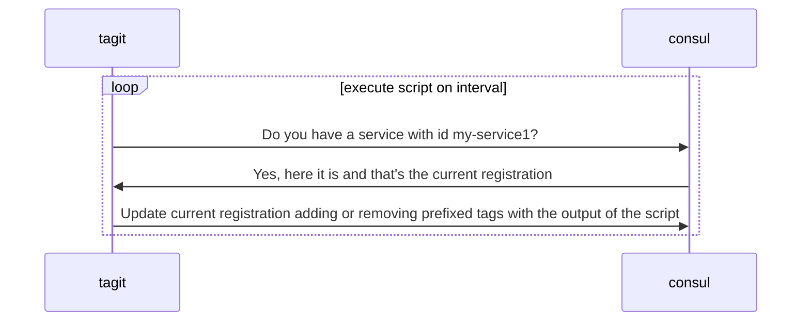

# TagIt

[](https://goreportcard.com/report/github.com/ncode/tagit)
[](https://opensource.org/licenses/Apache-2.0)
[](https://codecov.io/gh/ncode/tagit)

TagIt is a tool that updates Consul service registration tags with outputs of a script. It copies the current service registration and appends the output of the script line by line as tags, while keeping the original tags.

## Table of Contents

- [Why TagIt?](#why)
- [Installation](#installation)
- [Usage](#usage)
- [How It Works](#how-it-works)
- [Examples](#examples)
- [Contributing](#contributing)
- [License](#license)

## Why?

TagIt addresses a feature that's currently missing from Consul. You can read more about the need for this functionality in [this Consul issue](https://github.com/hashicorp/consul/issues/1048).

Here are some scenarios where TagIt can be useful:

1. **Database Leader Tagging**: Your databases are under `mydb.service.consul`, and you want to ensure all writes go to the leader.
   - Run a script that checks for the leader and updates the tag accordingly.

2. **Non-Consul-Aware Service Discovery**: You have a service that isn't Consul-aware, but you want to use Consul for service discovery.
   - Run a script that checks the service status and updates the tags.

3. **Web Server VHost Tagging**: You have a load balancer or web server, and you want tags for all vhosts served by this server.
   - Run a script that checks the vhosts and updates the tags.

4. **Generic Service Tagging**: For any services that aren't Consul-aware, but you want to use Consul for service discovery.
   - Run a script that checks the service and updates the tags.

## Installation

To install TagIt, you can use the following commands:

```bash
$ git clone https://github.com/ncode/tagit
$ cd tagit
$ go build
```

## Usage

TagIt provides two main commands: `run` and `cleanup`.

### Run Command

The `run` command starts TagIt and continuously updates the tags based on the script output:

```bash
$ ./tagit run --consul-addr=127.0.0.1:8500 --service-id=my-service1 --script=./examples/tagit/example.sh --interval=5s --tag-prefix=tagit
```

### Cleanup Command

The `cleanup` command removes all tags with the specified prefix from the service:

```bash
$ ./tagit cleanup --consul-addr=127.0.0.1:8500 --service-id=my-service1 --tag-prefix=tagit
```

## How It Works

Here's a sequence diagram illustrating how TagIt interacts with Consul:

>>>>>>> 6a3e346 (update readme)


## Examples

Here's an example of how to test TagIt:

1. Start a Consul agent in development mode:
   ```bash
   consul agent -dev &
   ```

2. Register a service with Consul:
   ```bash
   curl --request PUT --data @examples/consul/my-service1.json http://127.0.0.1:8500/v1/agent/service/register
   ```

3. Run TagIt:
   ```bash
   ./tagit run --consul-addr=127.0.0.1:8500 --service-id=my-service1 --script=./examples/tagit/example.sh --interval=5s --tag-prefix=tagit
   ```

4. Clean up the tags:
   ```bash
   ./tagit cleanup --consul-addr=127.0.0.1:8500 --service-id=my-service1 --tag-prefix=tagit
   ```

## Contributing

Contributions to TagIt are welcome! Please feel free to submit a Pull Request.

## License

TagIt is licensed under the Apache License, Version 2.0. See the [LICENSE](LICENSE) file for details.
